    

<h1 align="center">ChatDev IDE: Building Your AI Agent</h1>

[![author][author-image]][author-url]
[![license][license-image]][license-url]
[![release][release-image]][release-url]
[![last commit][last-commit-image]][last-commit-url]
[![discord][discord-image]][discord-url]

[Screenshot](#-screenshot) &nbsp;&nbsp;|&nbsp;&nbsp; [GameWindow](#-game-window) &nbsp;&nbsp;|&nbsp;&nbsp; [ChatWindow](#-chat-window) &nbsp;&nbsp;|&nbsp;&nbsp; [PromptIDE](#-prompt-ide) &nbsp;&nbsp;|&nbsp;&nbsp; [Bots](#-bots) &nbsp;&nbsp;|&nbsp;&nbsp; [Installation](#-installation) &nbsp;&nbsp;

[author-image]: https://img.shields.io/badge/author-10cl-blue.svg
[author-url]: https://github.com/10cl
[license-image]: https://img.shields.io/github/license/10cl/chatdev?color=blue
[license-url]: https://github.com/10cl/chatdev/blob/main/LICENSE
[release-image]: https://img.shields.io/github/v/release/10cl/chatdev?color=blue
[release-url]: https://github.com/10cl/chatdev/releases/latest
[last-commit-image]: https://img.shields.io/github/last-commit/10cl/chatdev?label=last%20commit
[last-commit-url]: https://github.com/10cl/chatdev/commits
[discord-image]: https://img.shields.io/discord/977885982579884082?logo=discord
[discord-url]: https://discord.gg/fdjWfgGPjb

ChatDev IDE is a tools for building your AI agent, Whether it's NPCs in games or powerful agent tools, you can design what you want for this platform.

It accelerates prompt engineering through **JavaScript Support** that allows implementing complex prompting techniques.

[https://youtu.be/O0gC2Sxm0EQ?feature=shared](https://youtu.be/O0gC2Sxm0EQ?feature=shared)

## 📢 TLDR
* GameMode: in the AI Town Social Simulation, you can customize these NPCs & location mark.
* Agent Support: import from Agent Community or defined yours.
* PromptIDE: Automatic completion, Dual screen display, Visualize PromptFlow, JavaScript Support
* Not just ChatGpt, but the new Bing Chat, Google Bard, Claude, QianWen, iFlytek Spark, and more than 10 open source models.

## Feature comparison
<table style="width: 100%;">
  <tr>
    <th align="center">Feature</th>
    <th align="center">ChatDev IDE</th>
    <th align="center">ChatDev(OpenBMB)</th>
  </tr>
  <tr>
    <td align="center">Programming Approach</td>
    <td align="center">TypeScript</td>
    <td align="center">Python Code</td>
  </tr>
  <tr>
    <td align="center">WorkFlow</td>
    <td align="center"><a href="https://github.com/10cl/promptflowx/">promptflowx</a></td>
    <td align="center">ChatChainConfig.json</td>
  </tr>
  <tr>
    <td align="center">Supported LLMs</td>
    <td align="center">Rich Variety</td>
    <td align="center">OpenAI-only</td>
  </tr>
  <tr>
    <td align="center">PromptIDE</td>
    <td align="center">✅</td>
    <td align="center">❌</td>
  </tr>
  <tr>
    <td align="center">RPG Game</td>
    <td align="center">✅</td>
    <td align="center">❌</td>
  </tr>
  <tr>
    <td align="center">Scalable</td>
    <td align="center">✅</td>
    <td align="center">❌</td>
  </tr>
  <tr>
    <td align="center">One-click Deployment</td>
    <td align="center">✅</td>
    <td align="center">❌</td>
  </tr>
</table>

## ✨ Game Window
[Generative_agents_dev](https://github.com/10cl/generative_agents_dev/) is the most exciting part, all the roles you can customize, you can design a mathematician, a psychological analysis expert to solve various problems for you, you just need to define a reasonable Prompt role definition, the richness of the map will be completely controlled by you, if you are satisfied with your design, you can also share it with us, we will recommend it to other users.
In Game Window, you can choose your favorite large model on the left, on the map, control the NPC's actions through the direction keys or mouse, when you are close to the NPC or reach the marked position, the NPC will actively trigger the cold start response, or actively enter your chat content in the input box below.
the game is based on a simulated AI town social environment, you can get close to the NPC or walk to a specific location, through the input and NPC to communicate or chat with yourself in a specific location.

## ✨ Chat Window
Choose Chat Window, and click `Switch to Chat Mode...` in the upper right corner, select your favorite large model on the left, Chat Window will be a regular LLM Chat UI, 
and all your inputs will be through the normal LLM interface, output the reply of the large model.

## ✨ Prompt IDE
[Promptflowx](https://github.com/10cl/promptflowx/) is a suite of development tools designed to streamline the end-to-end development cycle of LLM-based AI applications, from ideation, prototyping, testing, evaluation.    It makes prompt engineering much easier and enables you to build LLM apps with production quality.

- **Prompt Flow Editor**: Used to edit the YAML file of `Prompt Flow` and the prompt content and JavaScript script of the node
- **Prompt Flow Visualization**: Through the visualization of the execution process of the Prompt Flow node, the color of the node will change when it is executed to a certain node
- **JavaScript Support**: Through JavaScript scripts, you can use your creativity to realize the cooperation of different NPCs to achieve your Agent
- **Export & Import**: You can import other excellent Agent or share your Agent

### PromptFow Editor

- YAML syntax highlighting
- automatic completion for NPCs name & Prompt Library.
- dual screen display

Create and iteratively develop flow with PromptFow Editor
- Create executable flows that link LLMs, prompts, **JavaScript** code and other tools together.
- Debug and iterate your flows, especially the interaction with LLMs with ease.

left editor is the YAML file of PromptFlow, where `path` and `func` are highlighted, indicating that a custom Prompt is referenced. You can move the mouse and click on the node on `path` or `func`, and the right side will display the Prompt you customized on the node. The rightmost folded interface is the visual Prompt Flow. You can also edit the Prompt content of the node by double-clicking the node.
When you modify the YAML file on the left, the visual Prompt Flow on the right will be updated in real time.

### PromptFow visualization
While how LLMs work may be elusive to many developers, how LLM apps work is not - they essentially involve a series of calls to external services such as LLMs/databases/search engines, or intermediate data processing, all glued together. Thus LLM apps are merely Directed Acyclic Graphs (DAGs) of function calls. These DAGs are flows in prompt flow.
By observing many internal use cases, we learned that deeper insight into the detail of the execution is critical. Establishing a systematic method for tracking interactions with external systems is one of design priority. Consequently, We adopted an unconventional approach - prompt flow has a YAML file describing how function calls (we call them Tools) are executed and connected into a Directed Acyclic Graph (DAG).

### Export & Import
You can export your prompt flow to a json file and import it to another devices.
it contains all the information about your prompt flow, including the prompt, the JavaScript functions, and the YAML file.

## 🤖 Bots
ChatGpt、Bing、Bard、Claude、LLama 2、Vicuna、Falcon、Qianwen、iFlytek Spark

## 🔨 Installation

### 1. Install from Web Store

1. Search for [ChatDev](https://chrome.google.com/webstore/detail/chatdev/dopllopmmfnghbahgbdejnkebfcmomej) in the [Chrome Web Store](https://chrome.google.com/webstore/category/extensions) and click "Install."
2. Search for [ChatDev](https://microsoftedge.microsoft.com/addons/detail/chatdev-visualize-your-a/ceoneifbmcdiihmgfjeodiholmbpmibm) in the [Microsoft-Edge-Extensions](https://microsoftedge.microsoft.com/addons/Microsoft-Edge-Extensions-Home) and click "Get."

### 2. Manual Installation

1. Download `chatdev1.5.0.zip` from the Releases page.
2. Extract the files.
3. In Chrome/Edge, open the extensions page (`chrome://extensions` or `edge://extensions`).
4. Enable developer mode.
5. Drag and drop the extracted folder onto the page to import it (do not delete the folder after importing).

### 3. Build from Source Code

* Clone the source code.
* Run `yarn install` to install dependencies.
* Run `yarn build` to build the plugin.
* Follow the steps in "Manual Installation" to load the `dist` folder into your browser.
