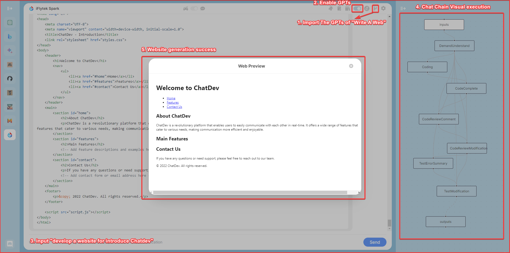
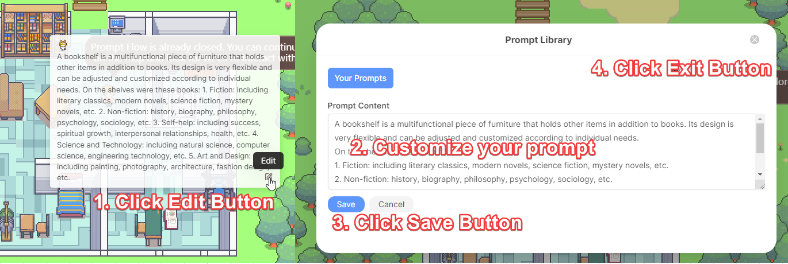
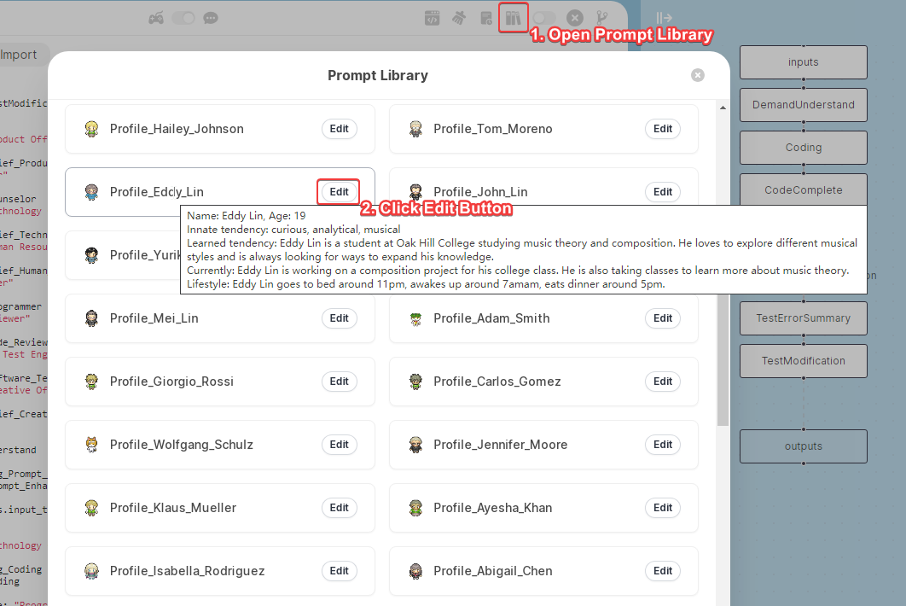

<p align="center">
    
</p>
<h1 align="center">ChatDev: Visualize Your AI Agent</h1>

<div align="center">

[![author][author-image]][author-url]
[![license][license-image]][license-url]
[![release][release-image]][release-url]
[![last commit][last-commit-image]][last-commit-url]
[![discord][discord-image]][discord-url]

English &nbsp;&nbsp;|&nbsp;&nbsp; [Indonesia](README_IN.md) &nbsp;&nbsp;|&nbsp;&nbsp; [简体中文](README_ZH-CN.md) &nbsp;&nbsp;|&nbsp;&nbsp; [繁體中文](README_ZH-TW.md) &nbsp;&nbsp;|&nbsp;&nbsp; [日本語](README_JA.md)

<a href="https://chrome.google.com/webstore/detail/chatdev-visualize-your-ai/dopllopmmfnghbahgbdejnkebfcmomej?utm_source=github"></a>
<a href="https://microsoftedge.microsoft.com/addons/detail/ceoneifbmcdiihmgfjeodiholmbpmibm?utm_source=github"></a>


[Screenshot](#-screenshot) &nbsp;&nbsp;|&nbsp;&nbsp; [GameMode](#-game-mode) &nbsp;&nbsp;|&nbsp;&nbsp; [ChatMode](#-chat-mode) &nbsp;&nbsp;|&nbsp;&nbsp; [PromptIDE](#-prompt-ide) &nbsp;&nbsp;|&nbsp;&nbsp; [Bots](#-bots) &nbsp;&nbsp;|&nbsp;&nbsp; [Installation](#-installation) &nbsp;&nbsp;|&nbsp;&nbsp; [Changelog](#-changelog)

[author-image]: https://img.shields.io/badge/author-10cl-blue.svg
[author-url]: https://github.com/10cl
[license-image]: https://img.shields.io/github/license/10cl/chatdev?color=blue
[license-url]: https://github.com/10cl/chatdev/blob/main/LICENSE
[release-image]: https://img.shields.io/github/v/release/10cl/chatdev?color=blue
[release-url]: https://github.com/10cl/chatdev/releases/latest
[last-commit-image]: https://img.shields.io/github/last-commit/10cl/chatdev?label=last%20commit
[last-commit-url]: https://github.com/10cl/chatdev/commits
[discord-image]: https://img.shields.io/discord/977885982579884082?logo=discord
[discord-url]: https://discord.com/channels/977885982579884082/

</div>

ChatDev is an integrated multiple large language model Chrome Extension, It consists of three parts: **Game Mode**、**Chat Mode** and **Prompt IDE**.

you can personalize these NPCs, customize the location's prompt, and build your GPTs with the visualize prompt editor, run GPTs let NPCs Multi-Persona Self-Collaboration.

It accelerates prompt engineering through **JavaScript Support** that allows implementing complex prompting techniques.

## 📷 Screenshot



## 📢 TLDR
* GameMode: in the AI Town Social Simulation, you can customize these NPCs & location mark.
* GPTs Support: import from GPTs Community or defined yours.
* PromptIDE: Automatic completion, Dual screen display, Visualize PromptFlow, JavaScript Support
* Not just ChatGpt, but the new Bing Chat, Google Bard, Claude, QianWen, iFlytek Spark, and more than 10 open source models.

## ✨ Game Mode
This is the most exciting part, all the roles you can customize, you can design a mathematician, a psychological analysis expert to solve various problems for you, you just need to define a reasonable Prompt role definition, the richness of the map will be completely controlled by you, if you are satisfied with your design, you can also share it with us, we will recommend it to other users.
In Game Mode, you can choose your favorite large model on the left, on the map, control the NPC's actions through the direction keys or mouse, when you are close to the NPC or reach the marked position, the NPC will actively trigger the cold start response, or actively enter your chat content in the input box below.
the game is based on a simulated AI town social environment, you can get close to the NPC or walk to a specific location, through the input and NPC to communicate or chat with yourself in a specific location.

- **Location Prompt**: Let the player chat with himself by describing the prompt of the marked location
- **Npc Role Prompt**: Let the player chat with NPC by describing the prompt of NPC, to achieve the purpose of self-introduction between the player and NPC.
- **Memory**: Your chat will be stored locally, and you can view the historical chat records of the marked location or NPC by hovering the mouse.
- **GPTs**: Import GPTs from the community or customize Prompt Flow in PromptIDE to achieve new GPTs, run GPTs to let NPCs achieve multi-person self-collaboration to complete tasks

### Social Simulation


This is a simulated AI town social environment, consisting of 25 NPCs with independent consciousness and a controlled player, the map size is 180x100, and the size of a single grid is defined as 32. 25 NPCs have predefined daily life trajectories. You can get close to the NPC for chat input by customizing the NPC's prompt description, or you can customize your prompt description for the marked location and chat with yourself when you walk to the marked location.
When the distance between the player and the NPC <100, the NPC will trigger the active greeting according to the predefined role description. When the distance between the player and the NPC >200, the chat area will be automatically ended.

### Location Prompt
When you move your mouse to a marked location, the prompt description of the current mark will pop up. You can click the "Edit" button to describe the prompt of the location you specified. When you are close to this mark or directly talk at this location, the prompt will be used as background knowledge and you will have a dialogue.



Except for the custom prompt for the marked location, you also need a fixed form of prompt combination to generate a complete prompt, so that the large model can understand our intentions.
For example, when you control the NPC to a specified mark location, we need to tell the large model what you want to do. At this time, we need a fixed prompt, such as our predefined "Action_Influence_Env_Changed". The role of this prompt is to tell the large model that the player's position has changed. We will combine the content of this prompt with your custom prompt for the marked position to generate a complete prompt and give it to the large model. The large model will then output an effective response to you.

#### Location Action Prompt
Action prompt is a predefined prompt, which is triggered when the player reaches the marked position. The predefined prompt and the prompt description of the marked position are combined to form a complete prompt, which is provided to the large model, and the large model outputs an effective response to you.

##### Action_Influence_Env_Changed
This is a predefined prompt, which is triggered when the player **reaches the marked position**. The predefined prompt and the prompt description of the marked position are combined to form a complete prompt, which is provided to the large model, and the large model outputs an effective response to you.

Currently defined as:
```text
You are a mark on the game map, and this is your description:
####################
{player_position}
####################
I just arrived here. current time is {now_time}, this is where I usually record conversations and plan future events. 
please ask me a short question To get what conversation or project would you like to record.

1. no need to output your analysis process
2. Output language: {lang}

Now, your prompt:
```

- `{lang}` is a common variable, which represents the language environment of the current browser, such as "zh", "en", "ja", etc.
- `{history}` is a common variable, which represents the input history of the player at the marked position.
- `{player_name}` is a common variable, which represents the name of the current player. You have replied to the player's name when you first entered ChatDev.
- `{player_position}` is a common variable, which represents the marked position of the current player. The content filled in is your custom prompt for the marked position.
- `{now_time}` is a common variable, which represents the current time, such as "2021-08-01 12:00:00".

you can refer to the implementation of your own prompt by utilizing the common variables above.

##### Action_Target_Dialogue_Env
This is a predefined prompt, which is triggered when the player **inputs at the marked position**, the input content and the current defined prompt and the prompt description of the marked position form a complete prompt, which is provided to the large model, and the large model outputs an effective response to you.

Currently defined as:
```text
You are a mark on the game map, and this is your description:
####################
{player_position}
####################
Current time is {now_time}, we are chatting. I say: >>>>{input_text}<<<<

1. no need to output your analysis process
2. Output language: {lang}

Now, your prompt:
```

- `{input_text}` is a common variable, which represents the content you input in the input box.
- `{player_position}` is a common variable, which represents the marked position of the current player. The content filled in is your custom prompt for the marked position.
- `{now_time}` is a common variable, which represents the current time, such as "2021-08-01 12:00:00".
- `{lang}` is a common variable, which represents the language environment of the current browser, such as "zh", "en", "ja", etc.

>Requirements: 1. Concise: because this is a chat scene, you can require the large model to be as concise as possible

### Npc Prompt
There are a total of **25** NPCs in the AI town. The behavior trajectories of these NPCs are predefined, but you can input chat by controlling the player to approach the NPC.

You can customize the NPC's prompt description (Profile) to the NPC, when you approach the NPC, the NPC will actively ask through our predefined `Action_Influence_Npc_Near`, when you enter the content chat, the NPC will use our predefined `Action_Target_Dialogue_Npc` as the NPC role and chat with you.

#### Profile
You can move the mouse to the NPC character to view the self-introduction of the character, or you can click the "Edit" button to describe the self-introduction of the character you specified. When you are close to this character, the self-introduction will be used as background knowledge and you will have a dialogue.



##### Profile_Hailey_Johnson

##### Profile_Tom_Moreno

##### Profile_Eddy_Lin

##### Profile_John_Lin

##### Profile_Yuriko_Yamamoto

##### Profile_Sam_Moore

##### Profile_Mei_Lin

##### Profile_Adam_Smith

##### Profile_Giorgio_Rossi

##### Profile_Carlos_Gomez

##### Profile_Wolfgang_Schulz

##### Profile_Jennifer_Moore

##### Profile_Klaus_Mueller

##### Profile_Ayesha_Khan

##### Profile_Isabella_Rodriguez

##### Profile_Abigail_Chen

##### Profile_Carmen_Ortiz

##### Profile_Francisco_Lopez

##### Profile_Jane_Moreno

##### Profile_Latoya_Williams

##### Profile_Arthur_Burton

##### Profile_Rajiv_Patel

##### Profile_Tamara_Taylor

##### Profile_Ryan_Park

##### Profile_Maria_Lopez


#### NPC Action Prompt
Action prompt is a predefined prompt, which is triggered when the player reaches the NPC. The predefined prompt and the NPC's prompt description are combined to form a complete prompt, which is provided to the large model, and the large model outputs an effective response to you.

##### Action_Influence_Npc_Near
This is a predefined prompt, which is triggered when the player **approaches the NPC**. The predefined prompt and the NPC's prompt description are combined to form a complete prompt, which is provided to the large model, and the large model outputs an effective response to you.

Currently defined as:
```text
The following is your personal introduction:
####################
{npc_intro}
####################

Current time is {now_time}

I just met you, what you might say?
1. If there is no more context to indicate that they are meeting for the first time, Introduce yourself and regular chat greeting
2. no need to output your analysis process
3. Output language: {lang}
```

- `{npc_intro}` is a common variable, which represents the NPC's custom prompt description.
- `{npc_activity}` is a common variable, which represents the NPC's activity, such as "sleeping", "eating", "working", etc.
- `{history}` is a common variable, which represents the historical input record of chatting with the current NPC.
- `{now_time}` is a common variable, which represents the current time, such as "2021-08-01 12:00:00".
- `{lang}` is a common variable, which represents the language environment of the current browser, such as "zh", "en", "ja", etc.

##### Action_Target_Dialogue_Npc
This is a predefined prompt, which is triggered when the player **inputs near the NPC**, the input content and the current defined prompt and the NPC's prompt description form a complete prompt, which is provided to the large model, and the large model outputs an effective response to you.

Currently defined as:
```text
The following is your personal introduction:
####################
{npc_intro}
####################
Current time is {now_time}, we are chatting.
I say: >>>>{input_text}<<<<. what you might say?
1. no need to output your analysis process
2. Output language: {lang}
```

- `{npc_intro}` is a common variable, which represents the NPC's custom prompt description.
- `{input_text}` is a common variable, which represents the content you input in the input box.
- `{now_time}` is a common variable, which represents the current time, such as "2021-08-01 12:00:00".
- `{lang}` is a common variable, which represents the language environment of the current browser, such as "zh", "en", "ja", etc.

>Requirements: 1. Concise: because this is a chat scene, you can require the large model to be as concise as possible

### GPTs
GPTs is a large language model, you can import GPTs from the community or customize Prompt Flow in PromptIDE to achieve new GPTs, run GPTs to let NPCs achieve multi-person self-collaboration to complete tasks.
in the GPTs, if the GPTs's Prompt Flow defines the role(`npc`, see [Flows](#flows) for details), and assigns the NPC in the map to the role, then they will gather together in the map to hold a seminar and execute the complete process of GPTs. If no role is defined, you can view the complete execution process in Chat Mode and have a dialogue in the usual LLM way.

## ✨ Chat Mode
when you choose Chat Mode, and close the `GPTs` in the upper right corner, select your favorite large model on the left, Chat Mode will be a regular LLM UI, and all your inputs will be through the normal LLM interface, output the reply of the large model.


### GPTs Community
You can import GPTs from the community, and you can also share your GPTs with others.


### Chat History
Your chat will be stored locally, and you can view the historical chat records of the marked location or NPC by hovering the mouse.


### Chat Chain
in Chat Mode, if you are in Chat Mode, then the execution of Prompt Flow will be in the form of Chat Chain, and the execution of Prompt Flow will be in the form of Chat Chain in the chat box.
right-click to open GPTs in the upper right corner, enter your one-sentence demand, your input will be used as the input variable `${inputs.input}` in `Chat Chain`, and `Chat Chain` will execute the corresponding node according to your input. The execution order of the node is from top to bottom. If the input variable of the node is satisfied, the node will be executed, otherwise the node will be skipped and the next node will be executed.


## ✨ Prompt IDE
Prompt flow is a suite of development tools designed to streamline the end-to-end development cycle of LLM-based AI applications, from ideation, prototyping, testing, evaluation.    It makes prompt engineering much easier and enables you to build LLM apps with production quality.


- **Prompt Flow Editor**: Used to edit the YAML file of `Prompt Flow` and the prompt content and JavaScript script of the node
- **Prompt Flow Visualization**: Through the visualization of the execution process of the Prompt Flow node, the color of the node will change when it is executed to a certain node
- **JavaScript Support**: Through JavaScript scripts, you can use your creativity to realize the cooperation of different NPCs to achieve your GPTs
- **Export & Import**: You can import other excellent GPTs or share your GPTs

### PromptFow Editor

- YAML syntax highlighting
- automatic completion for NPCs name & Prompt Library.
- dual screen display

Create and iteratively develop flow with PromptFow Editor
- Create executable flows that link LLMs, prompts, **JavaScript** code and other tools together.
- Debug and iterate your flows, especially the interaction with LLMs with ease.

left editor is the YAML file of PromptFlow, where `path` and `func` are highlighted, indicating that a custom Prompt is referenced. You can move the mouse and click on the node on `path` or `func`, and the right side will display the Prompt you customized on the node. The rightmost folded interface is the visual Prompt Flow. You can also edit the Prompt content of the node by double-clicking the node.
When you modify the YAML file on the left, the visual Prompt Flow on the right will be updated in real time.


### PromptFow visualization
While how LLMs work may be elusive to many developers, how LLM apps work is not - they essentially involve a series of calls to external services such as LLMs/databases/search engines, or intermediate data processing, all glued together. Thus LLM apps are merely Directed Acyclic Graphs (DAGs) of function calls. These DAGs are flows in prompt flow.
By observing many internal use cases, we learned that deeper insight into the detail of the execution is critical. Establishing a systematic method for tracking interactions with external systems is one of design priority. Consequently, We adopted an unconventional approach - prompt flow has a YAML file describing how function calls (we call them Tools) are executed and connected into a Directed Acyclic Graph (DAG).

### Flows

A flow in PromptFlow is a DAG (Directed Acyclic Graph) of prompts/functions, referred to as nodes. These nodes are connected via input/output dependencies and are executed based on the topology by the PromptFlow executor. A flow is represented as a YAML file and can be visualized using our IDE. Here is an example:

* **outputs**

```yaml
outputs:
  overview:
    reference: ${TestModification}
```

Indicates the definition of the current node's output content. `${TestModification}` references the node's name, signifying that the current node's output is the output of the `TestModification` node (`output` variable).

* **roles (optional)**

```yaml
roles:
  - name: "Chief Product Officer"
    npc: "Mei Lin"
    source:
      path: Role_Chief_Product_Officer
```

An optional field defining the execution role for the current node. It includes the role's name, an optional NPC for visualization, and the definition of the role's prompt content.

* **nodes**

```yaml
nodes:
  - name: DemandUnderstand
    source:
      path: Planning_Prompt_Enhance
      func: Func_Prompt_Enhance
    inputs:
      task: ${inputs.input_text}

  - name: task_company
    source:
      path: Planning_Task_Company
    inputs:
      assistant_role: "Chief Product Officer"
      task: ${DemandUnderstand.output}
```

The crucial part of the entire PromptFlow, defining roles, content, and handling of return content. Nodes specify task execution roles, content, and the processing of returned content.

### JavaScript Support

JavaScript is a powerful language used for implementing complex prompting techniques in PromptFlow. It enables developers to implement intricate prompting techniques and rich analytics for visualizing PromptFlow outputs.

* **Variable Scope**

  * **Input Variables (inputs node):** `source.path` represents a custom prompt with unknown variables like `{xxx}`. For example, defining `task` as an input variable: `${DemandUnderstand.output}` replaces `{task}` in the prompt with `${DemandUnderstand.output}`.

    * `task: ${inputs.input}`: Using a generic input local variable. `${inputs.input}` represents the complete content entered in the input box.
    * `xxx: ${node_name.variable}`: Defining your input variable `xxx`, `${node_name.variable}` references a local variable in another node.
  * **Output Variables:**

    * `output`: Represents the complete content returned by a large model. Referenced in other nodes as `node_name.output`.
    * `func`: Custom local variables defined in the `JavaScript` script of a node.
  * **Variable Scope:** Local to the current node. Define variables using `let` or `const`.

* **Exception Handling**

  * Manually throw exceptions in `func` using `throw new Error("xxx")`, where `xxx` is a custom prompt. When a node encounters an exception, it will output the exception information to the console.

  * Manually throwing exceptions allows you to identify and fix issues in your code during execution.

>**Important Note:** Avoid using `console.log("xxx")` for logging, as `console` is not a global variable in the node's context.

### Export & Import
You can export your prompt flow to a json file and import it to another devices.
it contains all the information about your prompt flow, including the prompt, the JavaScript functions, and the YAML file.

### GPTs Example
Our examples should also give you an idea how to use that:

#### Roles
```yaml

roles:
  - name: "Chief Product Officer"
    npc: "Mei Lin"
    source:
      path: Role_Chief_Product_Officer
  - name: "Counselor"
    npc: "Jennifer Moore"
    source:
      path: Role_Counselor
  - name: "Chief Technology Officer"
    npc: "Ryan Park"
    source:
      path: Role_Chief_Technology_Officer
  - name: "Chief Human Resource Officer"
    source:
      path: Role_Chief_Human_Resource_Officer
  - name: "Programmer"
    source:
      path: Role_Programmer
  - name: "Code Reviewer"
    source:
      path: Role_Code_Reviewer
  - name: "Software Test Engineer"
    source:
      path: Role_Software_Test_Engineer
  - name: "Chief Creative Officer"
    source:
      path: Role_Chief_Creative_Officer
```

##### Role_Chief_Product_Officer

##### Role_Counselor

##### Role_Chief_Technology_Officer

##### Role_Chief_Human_Resource_Officer

##### Role_Programmer

##### Role_Code_Reviewer

##### Role_Software_Test_Engineer

##### Role_Chief_Creative_Officer

#### Prompt Flow
```yaml
nodes:
  - name: DemandUnderstand
    source:
      path: Planning_Prompt_Enhance
      func: Func_Prompt_Enhance
    inputs:
      task: ${inputs.input_text}

  - name: Coding
    role: "Chief Technology Officer"
    source:
      path: Planning_Coding
      func: Func_Coding
    inputs:
      assistant_role: "Programmer"
      gui: ${DemandUnderstand.gui}
      ideas: ${DemandUnderstand.ideas}
      language: ${DemandUnderstand.language}
      modality: ${DemandUnderstand.modality}
      task: ${DemandUnderstand.task}

  - name: CodeComplete
    role: "Chief Technology Officer"
    source:
      path: Planning_CodeComplete
      func: Func_Coding
    inputs:
      assistant_role: "Programmer"
      unimplemented_file: ${Coding.unimplemented_file}
      codes: ${Coding.output}
      language: ${DemandUnderstand.language}
      modality: ${DemandUnderstand.modality}
      task: ${DemandUnderstand.task}

  - name: CodeReviewComment
    role: "Programmer"
    source:
      path: Planning_CodeReviewComment
    inputs:
      assistant_role: "Code Reviewer"
      codes: ${CodeComplete.output}
      ideas: ${DemandUnderstand.ideas}
      language: ${DemandUnderstand.language}
      modality: ${DemandUnderstand.modality}
      task: ${DemandUnderstand.task}

  - name: CodeReviewModification
    role: "Programmer"
    source:
      path: Planning_CodeReviewModification
      func: Func_Coding
    inputs:
      assistant_role: "Code Reviewer"
      comments: ${CodeReviewComment.output}
      codes: ${CodeComplete.output}
      ideas: ${DemandUnderstand.ideas}
      language: ${DemandUnderstand.language}
      modality: ${DemandUnderstand.modality}
      task: ${DemandUnderstand.task}

  - name: TestErrorSummary
    role: "Software Test Engineer"
    source:
      path: Planning_TestErrorSummary
    inputs:
      assistant_role: "Programmer"
      test_reports: "js & css should inline in index.html"
      codes: ${CodeReviewModification.output}
      language: ${DemandUnderstand.language}

  - name: TestModification
    role: "Software Test Engineer"
    source:
      path: Planning_TestModification
      func: Func_Coding
    inputs:
      assistant_role: "Programmer"
      error_summary: ${TestErrorSummary.output}
      test_reports: ${TestErrorSummary.output}
      codes: ${CodeReviewModification.output}
      language: ${DemandUnderstand.language}
```


##### Planning_Prompt_Enhance

##### Planning_Coding

##### Planning_CodeComplete

##### Planning_CodeReviewComment

##### Planning_CodeReviewModification

##### Planning_TestErrorSummary

##### Planning_TestModification


## 🤖 Bots

### ChatGpt

### Bing

### Bard

### Claude

### LLama 2

### Vicuna

### Falcon

### Qianwen

### iFlytek Spark

## 🔨 Installation

### 1. Install from Web Store

1. Search for [ChatDev](https://chrome.google.com/webstore/detail/chatdev/dopllopmmfnghbahgbdejnkebfcmomej) in the [Chrome Web Store](https://chrome.google.com/webstore/category/extensions) and click "Install."
2. Search for [ChatDev](https://microsoftedge.microsoft.com/addons/detail/chatdev-visualize-your-a/ceoneifbmcdiihmgfjeodiholmbpmibm) in the [Microsoft-Edge-Extensions](https://microsoftedge.microsoft.com/addons/Microsoft-Edge-Extensions-Home) and click "Get."

### 2. Manual Installation

1. Download `chatdev1.2.2.zip` from the Releases page.
2. Extract the files.
3. In Chrome/Edge, open the extensions page (`chrome://extensions` or `edge://extensions`).
4. Enable developer mode.
5. Drag and drop the extracted folder onto the page to import it (do not delete the folder after importing).

### 3. Build from Source Code

* Clone the source code.
* Run `yarn install` to install dependencies.
* Run `yarn build` to build the plugin.
* Follow the steps in "Manual Installation" to load the `dist` folder into your browser.

## 📜 Changelog
* v1.2.2
  * GPTs
  * PromptIDE

* v1.1.3

  * Flow_Dag_Yaml prompt type Add config prompt type, that is, do not send this node to the large model, and directly return the path content for parsing (Add Planning_Task_Team_Org configuration of NPC participating in the meeting)
  * Mouse over the markers (NPCs, furniture, etc.) to display prompt description and edit button
  * Default speed increased from 0.5 to 1, and reduced to 0.5 when chatting with NPCs
  * When starting a round table, automatically select the appropriate meeting address, draw the area of the meeting, and temporarily stop the player action.
  * The round table automatically ends when the player leaves the round table area
  * When you get close to an NPC, draw the area of the chat
  * When the NPC is less than 400 away from the player, the current activity record is not output, the distance is less than 100 and the chat is automatically requested, and the chat is automatically ended when the NPC is out of the chat area (> 200)
  * The icon in the upper left corner only keeps the button to control the volume, and cancelling the switch and one-click home function of the control prompt
  * Reduce the location change of the mark point, and support the mark address can be customized prompt, the location is defined as "Position_base64(xxx)"
  * Chat record storage is changed from localStorage to indexDb to prevent temporary over limit problems
  * Fixed an issue where the time loop would return home
  * Issue with modified air cannon messages
* v1.1.1

  * prompt flow double-click the editable node
  * Import or export all configurations
  * prompt library sharing
* v1.1.0

  * Support for multiple large language models
  * Customization of user roles
  * Support for custom prompts (actions, plans, etc.)
  * New visual editing for custom Prompt Flow
  * Support for switching between chat view and game view
  * Predefined Prompt Flows, enabling one-sentence requests to automatically select NPCs, form teams, execute tasks, and gamify presentations
  * Settings button for customizing APIs and selecting preferred models
  * Fixed API issues with iFlytek Spark model
* v1.0.1

  * Added support for iFlytek Spark cognitive large language model
* v1.0.0

  * Initial release of the AI town plugin based on ChatGPT

## 🤝 Acknowledgments

We sincerely thank the following projects for providing inspiration and reference: [generative_agents](https://github.com/joonspk-research/generative_agents)、[chathub](https://github.com/chathub-dev/chathub)

Whether you want to explore the wonders of different large language models or create your own virtual town life, ChatDev will be your reliable assistant. Install it now and start exploring!
