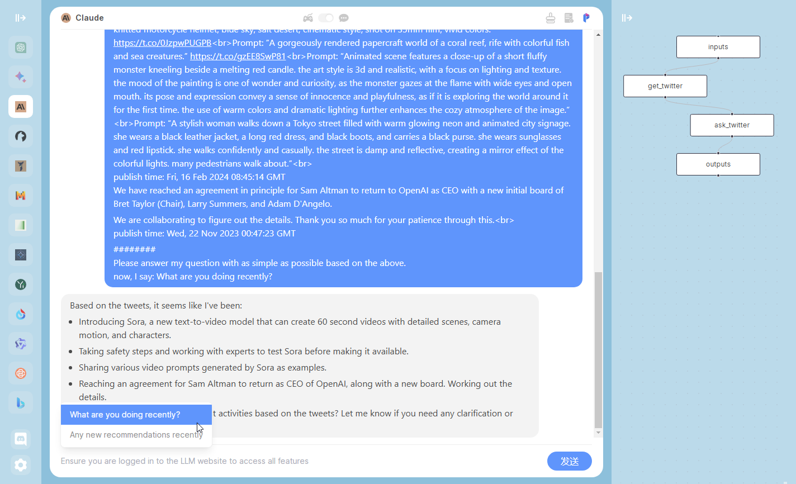

<p align="center">
    
</p>
<h1 align="center">ChatDev IDE: Building Your AI Agent</h1>

<div align="center">

[![author][author-image]][author-url]
[![license][license-image]][license-url]
[![release][release-image]][release-url]
[![last commit][last-commit-image]][last-commit-url]
[![discord][discord-image]][discord-url]

English &nbsp;&nbsp;|&nbsp;&nbsp; [简体中文](README_ZH-CN.md)

<a href="https://chrome.google.com/webstore/detail/chatdev-visualize-your-ai/dopllopmmfnghbahgbdejnkebfcmomej?utm_source=github"></a>
<a href="https://microsoftedge.microsoft.com/addons/detail/ceoneifbmcdiihmgfjeodiholmbpmibm?utm_source=github"></a>


[Screenshot](#-screenshot) &nbsp;&nbsp;|&nbsp;&nbsp; [GameMode](#-game-mode) &nbsp;&nbsp;|&nbsp;&nbsp; [ChatMode](#-chat-mode) &nbsp;&nbsp;|&nbsp;&nbsp; [PromptIDE](#-prompt-ide) &nbsp;&nbsp;|&nbsp;&nbsp; [Bots](#-bots) &nbsp;&nbsp;|&nbsp;&nbsp; [Installation](#-installation) &nbsp;&nbsp;

[author-image]: https://img.shields.io/badge/author-10cl-blue.svg
[author-url]: https://github.com/10cl
[license-image]: https://img.shields.io/github/license/10cl/chatdev?color=blue
[license-url]: https://github.com/10cl/chatdev/blob/main/LICENSE
[release-image]: https://img.shields.io/github/v/release/10cl/chatdev?color=blue
[release-url]: https://github.com/10cl/chatdev/releases/latest
[last-commit-image]: https://img.shields.io/github/last-commit/10cl/chatdev?label=last%20commit
[last-commit-url]: https://github.com/10cl/chatdev/commits
[discord-image]: https://img.shields.io/discord/977885982579884082?logo=discord
[discord-url]: https://discord.gg/fdjWfgGPjb

</div>


ChatDev IDE is a tools for building your AI agent, Whether it's NPCs in games or powerful agent tools, you can design what you want for this platform.

It accelerates prompt engineering through **JavaScript Support** that allows implementing complex prompting techniques.

[https://youtu.be/O0gC2Sxm0EQ?feature=shared](https://youtu.be/O0gC2Sxm0EQ?feature=shared)

## 📷 Screenshot


## 📢 TLDR
* GameMode: in the AI Town Social Simulation, you can customize these NPCs & location mark.
* Agent Support: import from Agent Community or defined yours.
* PromptIDE: Automatic completion, Dual screen display, Visualize PromptFlow, JavaScript Support
* Not just ChatGpt, but the new Bing Chat, Google Bard, Claude, QianWen, iFlytek Spark, and more than 10 open source models.

## ✨ Game Mode
This is the most exciting part, all the roles you can customize, you can design a mathematician, a psychological analysis expert to solve various problems for you, you just need to define a reasonable Prompt role definition, the richness of the map will be completely controlled by you, if you are satisfied with your design, you can also share it with us, we will recommend it to other users.
In Game Mode, you can choose your favorite large model on the left, on the map, control the NPC's actions through the direction keys or mouse, when you are close to the NPC or reach the marked position, the NPC will actively trigger the cold start response, or actively enter your chat content in the input box below.
the game is based on a simulated AI town social environment, you can get close to the NPC or walk to a specific location, through the input and NPC to communicate or chat with yourself in a specific location.

### Social Simulation


This is a simulated AI town social environment, consisting of 25 NPCs with independent consciousness and a controlled player, the map size is 180x100, and the size of a single grid is defined as 32. 25 NPCs have predefined daily life trajectories. You can get close to the NPC for chat input by customizing the NPC's prompt description, or you can customize your prompt description for the marked location and chat with yourself when you walk to the marked location.
When the distance between the player and the NPC <100, the NPC will trigger the active greeting according to the predefined role description. When the distance between the player and the NPC >200, the chat area will be automatically ended.

### customize your own map

Drag chatdev/src/assets/ex_assets/chatdev_main_map.json to TILED app.

### Agent
Agent is a large language model, you can import Agent from the community or customize Prompt Flow in PromptIDE to achieve new Agent, run Agent to let NPCs achieve multi-person self-collaboration to complete tasks.
in the Agent, if the Agent's Prompt Flow defines the role(`npc`, see [Flows](#flows) for details), and assigns the NPC in the map to the role, then they will gather together in the map to hold a seminar and execute the complete process of Agent. If no role is defined, you can view the complete execution process in Chat Mode and have a dialogue in the usual LLM way.

## ✨ Chat Mode
when you choose Chat Mode, and close the `Agent` in the upper right corner, select your favorite large model on the left, Chat Mode will be a regular LLM UI, and all your inputs will be through the normal LLM interface, output the reply of the large model.



### Agent Community
You can import Agent from the community, and you can also share your Agent with others.


### Chat History
Your chat will be stored locally, and you can view the historical chat records of the marked location or NPC by hovering the mouse.


### Chat Chain
in Chat Mode, if you are in Chat Mode, then the execution of Prompt Flow will be in the form of Chat Chain, and the execution of Prompt Flow will be in the form of Chat Chain in the chat box.
right-click to open Agent in the upper right corner, enter your one-sentence demand, your input will be used as the input variable `${inputs.input}` in `Chat Chain`, and `Chat Chain` will execute the corresponding node according to your input. The execution order of the node is from top to bottom. If the input variable of the node is satisfied, the node will be executed, otherwise the node will be skipped and the next node will be executed.


## ✨ Prompt IDE
Prompt flow is a suite of development tools designed to streamline the end-to-end development cycle of LLM-based AI applications, from ideation, prototyping, testing, evaluation.    It makes prompt engineering much easier and enables you to build LLM apps with production quality.


- **Prompt Flow Editor**: Used to edit the YAML file of `Prompt Flow` and the prompt content and JavaScript script of the node
- **Prompt Flow Visualization**: Through the visualization of the execution process of the Prompt Flow node, the color of the node will change when it is executed to a certain node
- **JavaScript Support**: Through JavaScript scripts, you can use your creativity to realize the cooperation of different NPCs to achieve your Agent
- **Export & Import**: You can import other excellent Agent or share your Agent

### PromptFow Editor

- YAML syntax highlighting
- automatic completion for NPCs name & Prompt Library.
- dual screen display

Create and iteratively develop flow with PromptFow Editor
- Create executable flows that link LLMs, prompts, **JavaScript** code and other tools together.
- Debug and iterate your flows, especially the interaction with LLMs with ease.

left editor is the YAML file of PromptFlow, where `path` and `func` are highlighted, indicating that a custom Prompt is referenced. You can move the mouse and click on the node on `path` or `func`, and the right side will display the Prompt you customized on the node. The rightmost folded interface is the visual Prompt Flow. You can also edit the Prompt content of the node by double-clicking the node.
When you modify the YAML file on the left, the visual Prompt Flow on the right will be updated in real time.


### PromptFow visualization
While how LLMs work may be elusive to many developers, how LLM apps work is not - they essentially involve a series of calls to external services such as LLMs/databases/search engines, or intermediate data processing, all glued together. Thus LLM apps are merely Directed Acyclic Graphs (DAGs) of function calls. These DAGs are flows in prompt flow.
By observing many internal use cases, we learned that deeper insight into the detail of the execution is critical. Establishing a systematic method for tracking interactions with external systems is one of design priority. Consequently, We adopted an unconventional approach - prompt flow has a YAML file describing how function calls (we call them Tools) are executed and connected into a Directed Acyclic Graph (DAG).

### Flows
A flow in PromptFlow is a DAG (Directed Acyclic Graph) of prompts/functions, referred to as nodes.
These nodes are connected via input/output dependencies and are executed based on the topology by the PromptFlow executor.
A flow is represented as a YAML file and can be visualized using our IDE.

Here is an example:

#### Write Agent/Agent
Indicates the definition of the current node's output content. `${TestModification}` references the node's name,
signifying that the current node's output is the output of the `TestModification` node (`output` variable).
This is a standard format, you need to ensure that 'desc' nodes are used to describe your Agent in the map, define 'reference' under 'outputs' nodes to represent the most total nodes, and make all nodes connected.

```yaml
# Required
desc: 'your Agent description' # In the game map, mouse over the description displayed by Agent

# Required
outputs:
  overview:
    reference: ${Chatting} # Final node

# The definition of a single node supports the text type and url type. The following is an example of the text type
nodes:
  - name: Chatting
    type: prompt
    source:
      path: Action_Prompt_Template # path of prompt.
    inputs:
      input_text: ${inputs.input_text} # `${inputs.input}` represents the complete content entered in the input box.
      intro: 'xxx'
```
in the prompt:
{intro} will replace by 'xxx'
{input_text} will replace by the content what you entered in the input box.

- The full Agent summarizing Twitter content are below：
```yaml
desc: 'summary elonmusk latest twitter'

outputs:
  overview:
    reference: ${summary_twitter}

nodes:
  - name: elonmusk
    speak: 'get elonmusk latest twitter' # speak represents the content of the game character displayed in the map, which does not result in a large amount of html displayed
    type: url
    source:
      path: 'https://chatdev.toscl.com/rattibha/user/elonmusk'
      func: Func_twitter # Optionally, func defines the path of the JavaScript used to parse the returned html content
    inputs:
      task: ${inputs.input_text}

  - name: summary_twitter
    source:
      path: Planning_Prompt_Twitter
    inputs:
      info: ${elonmusk.output} # `${elonmusk.output}` is a reference to the return content of the elonmusk node.
      task: ${inputs.input_text}
```

#### Write prompt
in the yaml, `source.path` for write prompt. select the highlighted section which is represented as prompt/function then you can edit it.
For example, defining `task` as an input variable in `inputs`, for example: `task: ${elonmusk.output}`,
`${elonmusk.output}` will replaces the string: `{task}` in the prompt.

#### Write Func
in the yaml, `source.func` for write JavaScript, this is optional.
the scope of a node object is global for `window`, so you can use any js code in `func`.
JQuery is also preset here, you can directly process your text by using `$`.
for example, you can use: `new DOMParser()` or `$('div#xml')`.
use `node.xxx`: represents a variable that references the current node, eg: `node.output`
use `node_name.xxx`: represents a variable that references another node


### Export & Import
You can export your prompt flow to a json file and import it to another devices.
it contains all the information about your prompt flow, including the prompt, the JavaScript functions, and the YAML file.

### Agent Example
Our examples should also give you an idea how to use that:

#### Chatting with NPC
- YAML
```yaml
desc: "Chatting with NPC"

inputs:
  input_text:
    type: string
    default: "Hello"
  auto: true

outputs:
  overview:
    reference: ${ChattingWith_Eddy_Lin}

nodes:
  - name: ChattingWith_Eddy_Lin
    source:
      path: Action_Target_Dialogue_Npc
    inputs:
      input_text: ${inputs.input_text}
      intro: "Name: Eddy Lin, Age: 19
Innate tendency: curious, analytical, musical
Learned tendency: Eddy Lin is a student at Oak Hill College studying music theory and composition. He loves to explore different musical styles and is always looking for ways to expand his knowledge.
Currently: Eddy Lin is working on a composition project for his college class. He is also taking classes to learn more about music theory.
Lifestyle: Eddy Lin goes to bed around 11pm, awakes up around 7amam, eats dinner around 5pm."
```

- Action_Target_Dialogue_Npc
```text
{intro}

current time is {now_time}, we are chatting.
I say to you: {input_text}. what you might say?
1. no need to output your analysis process
2. Output language: {lang}
```

#### Chatting with Twitter
- YAML
```yaml
desc: "Chat with BillGates"

inputs:
  input_text:
    type: string
    default: "What have I been doing lately"
  auto: true


outputs:
  overview:
    type: string
    reference: ${ask_twitter}

nodes:
  - name: get_BillGates_twitter
    speak: "get BillGates latest twitter"
    type: url
    source:
      path: "https://chatdev.toscl.com/rattibha/user/BillGates"
      func: Func_twitter
    inputs:
      task: ${inputs.input_text}


  - name: ask_twitter
    source:
      path: Planning_Prompt_Twitter
    inputs:
      info: ${get_BillGates_twitter.output}
      task: ${inputs.input_text}
```

- Func_twitter
```js
const xmlText = node.output
const parser = new DOMParser();
const xmlDoc = parser.parseFromString(xmlText, 'application/xml');
node.output = ""
const items = xmlDoc.querySelectorAll('item');
items.forEach(item => {
  const description = item.querySelector('description').textContent;
  const pubDate = item.querySelector('pubDate').textContent;
  const temp = node.output + description + " \n publish time: " + pubDate + "\n"
  if(temp.length <= 4000){
    node.output += temp
    console.log("length：" + node.output.length);
  }
});
console.log("length：" + node.output.length);
```

- Planning_Prompt_Twitter
```text
Here's what i tweeted recently:
########
{info}
########
Please answer my question with as simple as possible based on the above.
now, I say: {task}
```

#### Chatting with Any Url
- YAML
```yaml
desc: "url text body extraction"

outputs:
  overview:
    reference: ${ask_textbody}

nodes:
  - name: get_url_text_extract
    type: url
    source:
      path: "https://chatdev.toscl.com/"
      func: FUNC_Text_Extraction
    inputs:
      task: ${inputs.input_text}

  - name: ask_textbody
    source:
      path: Planning_Text_Ask
    inputs:
      info: ${get_url_text_extract.output}
      task: ${inputs.input_text}
```

- FUNC_Text_Extraction
use `Readability` to extract text from html.
```js
console.log("text extraction")
const parser = new DOMParser();
const doc = parser.parseFromString(node.output, "text/html");

var article = new Readability(doc).parse();
console.log(article);
node.output = article.textContent
```

- Planning_Prompt_Twitter
```text
Here's what i tweeted recently:
########
{info}
########
Please answer my question with as simple as possible based on the above.
now, I say: {task}
```

#### Generate a website in one sentence
```yaml
desc: "single Agent - generated web pages - multi-role collaborative presentation"

outputs:
  overview:
    type: html
    reference: ${TestModification}

roles:
  - name: "Chief Product Officer"
    npc: "Mei Lin"
    source:
      path: Role_Chief_Product_Officer
  - name: "Counselor"
    npc: "Jennifer Moore"
    source:
      path: Role_Counselor
  - name: "Chief Technology Officer"
    npc: "Ryan Park"
    source:
      path: Role_Chief_Technology_Officer
  - name: "Chief Human Resource Officer"
    npc: "Adam Smith"
    source:
      path: Role_Chief_Human_Resource_Officer
  - name: "Programmer"
    npc: "Carmen Ortiz"
    source:
      path: Role_Programmer
  - name: "Code Reviewer"
    npc: "Francisco Lopez"
    source:
      path: Role_Code_Reviewer
  - name: "Software Test Engineer"
    npc: "Latoya Williams"
    source:
      path: Role_Software_Test_Engineer
  - name: "Chief Creative Officer"
    npc: "Klaus Mueller"
    source:
      path: Role_Chief_Creative_Officer

nodes:
  - name: DemandUnderstand
    speak: "Optimize your demand..."
    source:
      path: Planning_Prompt_Enhance
      func: Func_Prompt_Enhance
    inputs:
      task: ${inputs.input_text}

  - name: Coding
    role: "Chief Technology Officer"
    source:
      path: Planning_Coding
      func: Func_Coding
    inputs:
      assistant_role: "Programmer"
      gui: ${DemandUnderstand.gui}
      ideas: ${DemandUnderstand.ideas}
      language: ${DemandUnderstand.language}
      modality: ${DemandUnderstand.modality}
      task: ${DemandUnderstand.task}

  - name: CodeComplete
    role: "Chief Technology Officer"
    speak: "code complete..."
    source:
      path: Planning_CodeComplete
      func: Func_Coding
    inputs:
      assistant_role: "Programmer"
      unimplemented_file: ${Coding.unimplemented_file}
      codes: ${Coding.output}
      language: ${DemandUnderstand.language}
      modality: ${DemandUnderstand.modality}
      task: ${DemandUnderstand.task}

  - name: CodeReviewComment
    speak: "code review..."
    role: "Programmer"
    source:
      path: Planning_CodeReviewComment
    inputs:
      assistant_role: "Code Reviewer"
      codes: ${CodeComplete.output}
      ideas: ${DemandUnderstand.ideas}
      language: ${DemandUnderstand.language}
      modality: ${DemandUnderstand.modality}
      task: ${DemandUnderstand.task}

  - name: CodeReviewModification
    speak: "code review modification..."
    role: "Programmer"
    source:
      path: Planning_CodeReviewModification
      func: Func_Coding
    inputs:
      assistant_role: "Code Reviewer"
      comments: ${CodeReviewComment.output}
      codes: ${CodeComplete.output}
      ideas: ${DemandUnderstand.ideas}
      language: ${DemandUnderstand.language}
      modality: ${DemandUnderstand.modality}
      task: ${DemandUnderstand.task}

  - name: TestErrorSummary
    speak: "test summary..."
    role: "Software Test Engineer"
    source:
      path: Planning_TestErrorSummary
    inputs:
      assistant_role: "Programmer"
      test_reports: "js & css should inline in index.html"
      codes: ${CodeReviewModification.output}
      language: ${DemandUnderstand.language}

  - name: TestModification
    speak: "test modification complete..."
    role: "Software Test Engineer"
    source:
      path: Planning_TestModification
      func: Func_Coding
    inputs:
      assistant_role: "Programmer"
      error_summary: ${TestErrorSummary.output}
      test_reports: ${TestErrorSummary.output}
      codes: ${CodeReviewModification.output}
      language: ${DemandUnderstand.language}
```

## 🤖 Bots

### ChatGpt

### Bing

### Bard

### Claude

### LLama 2

### Vicuna

### Falcon

### Qianwen

### iFlytek Spark

## 🔨 Installation

### 1. Install from Web Store

1. Search for [ChatDev](https://chrome.google.com/webstore/detail/chatdev/dopllopmmfnghbahgbdejnkebfcmomej) in the [Chrome Web Store](https://chrome.google.com/webstore/category/extensions) and click "Install."
2. Search for [ChatDev](https://microsoftedge.microsoft.com/addons/detail/chatdev-visualize-your-a/ceoneifbmcdiihmgfjeodiholmbpmibm) in the [Microsoft-Edge-Extensions](https://microsoftedge.microsoft.com/addons/Microsoft-Edge-Extensions-Home) and click "Get."

### 2. Manual Installation

1. Download `chatdev1.3.0.zip` from the Releases page.
2. Extract the files.
3. In Chrome/Edge, open the extensions page (`chrome://extensions` or `edge://extensions`).
4. Enable developer mode.
5. Drag and drop the extracted folder onto the page to import it (do not delete the folder after importing).

### 3. Build from Source Code

* Clone the source code.
* Run `yarn install` to install dependencies.
* Run `yarn build` to build the plugin.
* Follow the steps in "Manual Installation" to load the `dist` folder into your browser.