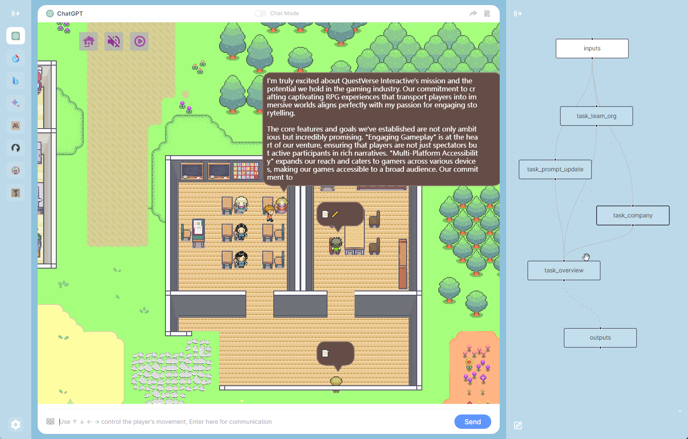

    

<h1 align="center">ChatDev：あなたのAIエージェントを可視化</h1>

[![author][author-image]][author-url]
[![license][license-image]][license-url]
[![release][release-image]][release-url]
[![last commit][last-commit-image]][last-commit-url]

[English](README.md) &nbsp;&nbsp;|&nbsp;&nbsp; [Indonesia](README_IN.md) &nbsp;&nbsp;|&nbsp;&nbsp; [簡体中文](README_ZH-CN.md) &nbsp;&nbsp;|&nbsp;&nbsp; [繁體中文](README_ZH-TW.md) &nbsp;&nbsp;|&nbsp;&nbsp; 日本語
##

### ⚡️ インストール

##

[スクリーンショット](#-スクリーンショット) &nbsp;&nbsp;|&nbsp;&nbsp; [機能](#-機能) &nbsp;&nbsp;|&nbsp;&nbsp; [ボット](#-ボット) &nbsp;&nbsp;|&nbsp;&nbsp; [インストール](#-インストール) &nbsp;&nbsp;|&nbsp;&nbsp; [変更履歴](#-変更履歴)

[author-image]: https://img.shields.io/badge/author-10cl-blue.svg
[author-url]: https://github.com/10cl
[license-image]: https://img.shields.io/github/license/10cl/chatdev?color=blue
[license-url]: https://github.com/10cl/chatdev/blob/main/LICENSE
[release-image]: https://img.shields.io/github/v/release/10cl/chatdev?color=blue
[release-url]: https://github.com/10cl/chatdev/releases/latest
[last-commit-image]: https://img.shields.io/github/last-commit/10cl/chatdev?label=last%20commit
[last-commit-url]: https://github.com/10cl/chatdev/commits

**ChatDev** は、複数の大規模言語モデルインターフェースを統合し、多様な対話体験を提供する強力な**Chrome拡張機能**です。Prompt-Flowタスクシーケンスの視覚的カスタマイズを使用すると、ゲーム内で異なる大規模モデルのパフォーマンスを探るだけでなく、独自のタスク実行フローを作成できます。仮想NPCと対話し、お好みの大規模モデルを選択してAIタウンで独自の思い出を作成できます。

## 📷 スクリーンショット

## ✨ 機能
* 1つのアプリケーションで異なるチャットボットを使用できます。現在はChatGPT、新しいBing Chat、Google Bard、Claude、10以上のオープンソースモデルをサポートしています。
* Webapisの形式でブラウザ内で大規模モデルインターフェースを呼び出すためにコードの能力は必要ありません。
* ゲームの形式でNPCと対話し、実際のニーズを議論します。
* NPCの役割定義をカスタマイズします。
* NPCの行動とプランのプロンプトをカスタマイズします。
* プロンプトフローをカスタマイズします。
* 一度プロンプトフローが有効になると、1文で必要性を表現し、NPCは自動的にチームを結成し、タスクを実行し、対話型のゲームスタイルでそれを提示します。

## 🤖 ボット
サポートされるチャットGPT＆iFlytek Spark＆Bing＆Bard＆Claude＆ChatGLM＆アルパカ＆ビクーニャ＆コアラ＆ドリー＆LLaMA＆StableLM＆OpenAssistant＆ChatRWKV...

## 🔨 インストール

### 1. Chrome Web Storeからインストール

[Chrome Web Store](https://chrome.google.com/webstore/category/extensions)で[ChatDev](https://chrome.google.com/webstore/detail/chatdev/dopllopmmfnghbahgbdejnkebfcmomej)を検索し、「インストール」をクリックします。

### 2. 手動インストール

1. リリースページから `chatdev1.1.1.zip` をダウンロードします。
2. ファイルを展開します。
3. Chrome/Edgeで拡張機能ページ（`chrome://extensions`または`edge://extensions`）を開きます。
4. 開発者モードを有効にします。
5. 展開されたフォルダをページにドラッグアンドドロップしてインポートします（インポート後、フォルダを削除しないでください）。

### 3. ソースコードからビルド

* ソースコードをクローンします。
* 依存関係をインストールするには `yarn install` を実行します。
* プラグインをビルドするには `yarn build` を実行します。
* "手動インストール"の手順に従って、`dist`フォルダをブラウザに読み込みます。

## 📜 変更履歴
* v1.1.1

    * プロンプトフローのダブルクリックで編集可能なノード
    * すべての設定のインポートまたはエクスポート
    * プロンプトライブラリの共有
* v1.1.0

    * 複数の大規模言語モデルのサポート
    * ユーザーの役割のカスタマイズ
    * カスタムプロンプト（アクション、プランなど）のサポート
    * カスタムプロンプトフローの新しい視覚的編集
    * チャットビューとゲームビューの切り替えのサポート
    * 予め定義されたプロンプトフロー、1文のリクエストでNPCを自動選択し、チームを結成し、タスクを実行し、ゲーム化したプレゼンテーションを行います。
    * APIのカスタマイズと好みのモデルの選択を行うための設定ボタン
    * iFlytek SparkモデルのAPIの問題を修正
* v1.0.1

    * iFlytek Spark認知大規模言語モデルのサポートを追加
* v1.0.0

    * ChatGPTベースのAIタウンプラグインの初回リリース

## 🤝 謝辞

以下のプロジェクトに感謝申し上げます。インスピレーションと参考情報を提供していただきました：[generative_agents](https://github.com/joonspk-research/generative_agents)、[chathub](https://github.com/chathub-dev/chathub)

異なる大規模言語モデルの驚異を探索したり、独自の仮想タウンライフを作成したりしたい場合、ChatDevは信頼できるアシスタントとなります。今すぐインストールして探索を始めましょう！
