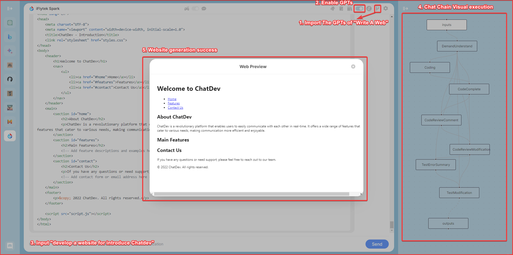
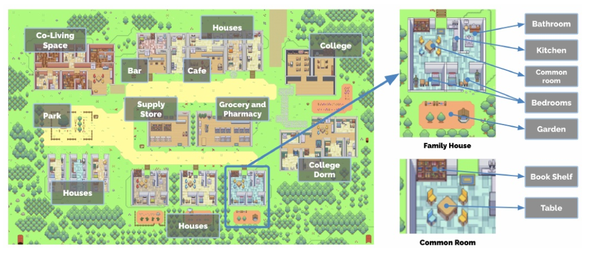
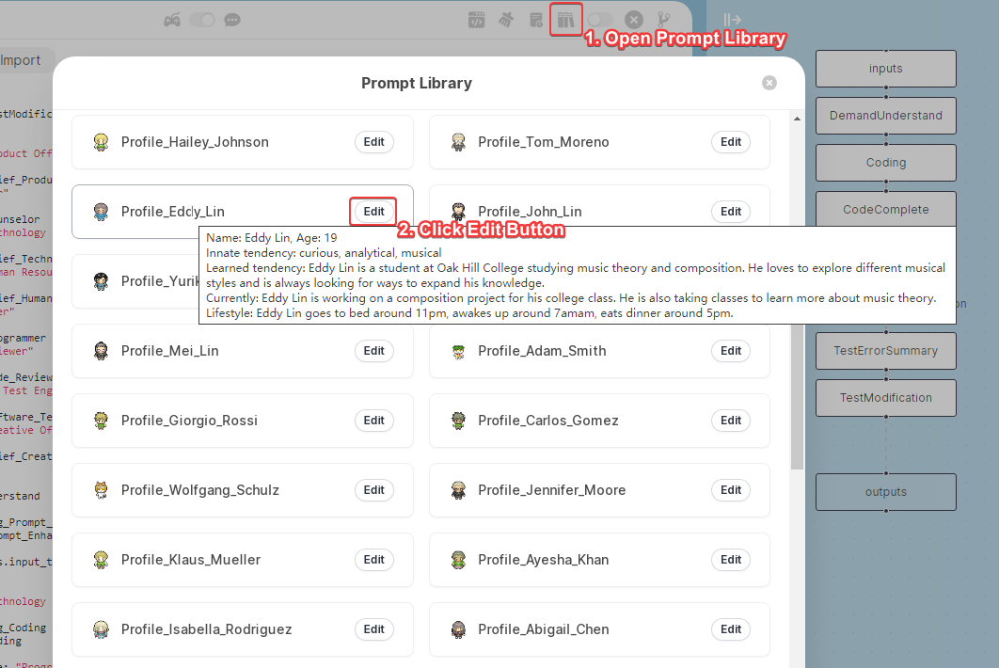
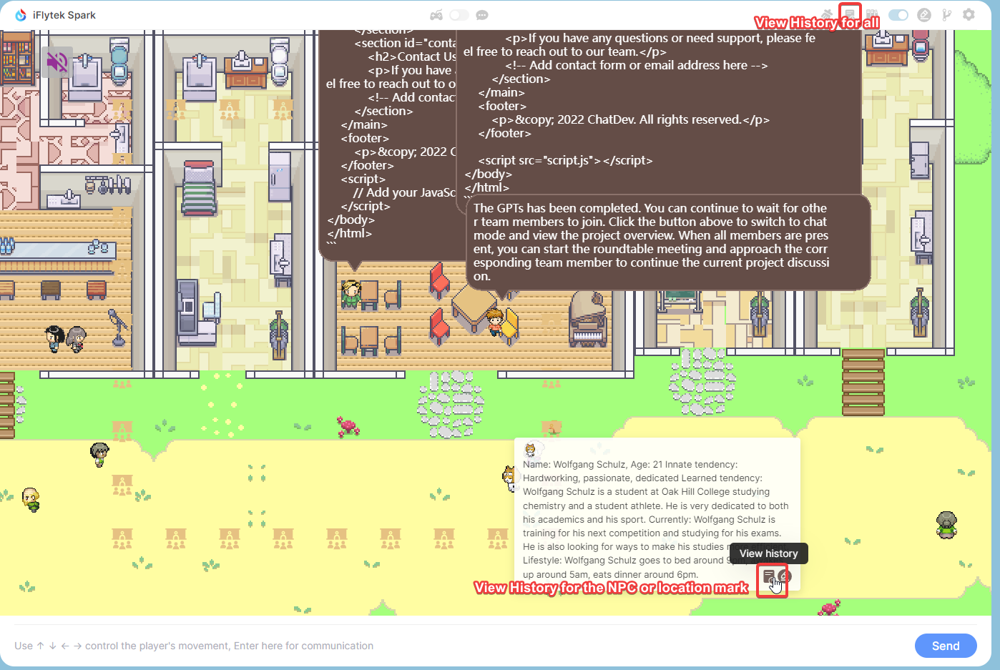

<p align="center">
    
</p>
<h1 align="center">ChatDev IDE：构建你的AI代理</h1>

<div align="center">

[![author][author-image]][author-url]
[![license][license-image]][license-url]
[![release][release-image]][release-url]
[![last commit][last-commit-image]][last-commit-url]
[![discord][discord-image]][discord-url]

[英语](README.md) &nbsp;&nbsp;|&nbsp;&nbsp; [印度尼西亚语](README_IN.md) &nbsp;&nbsp;|&nbsp;&nbsp; 简体中文 &nbsp;&nbsp;|&nbsp;&nbsp; [繁体中文](README_ZH-TW.md) &nbsp;&nbsp;|&nbsp;&nbsp; [日本语](README_JA.md)

<a href="https://chrome.google.com/webstore/detail/chatdev-visualize-your-ai/dopllopmmfnghbahgbdejnkebfcmomej?utm_source=github"></a>
<a href="https://microsoftedge.microsoft.com/addons/detail/ceoneifbmcdiihmgfjeodiholmbpmibm?utm_source=github"></a>


[截图](#-截图) &nbsp;&nbsp;|&nbsp;&nbsp; [游戏模式](#-游戏模式) &nbsp;&nbsp;|&nbsp;&nbsp; [聊天模式](#-聊天模式) &nbsp;&nbsp;|&nbsp;&nbsp; [PromptIDE](#-prompt-ide) &nbsp;&nbsp;|&nbsp;&nbsp; [机器人](#-机器人) &nbsp;&nbsp;|&nbsp;&nbsp; [安装](#-安装) &nbsp;&nbsp;

[author-image]: https://img.shields.io/badge/作者-10cl-blue.svg
[author-url]: https://github.com/10cl
[license-image]: https://img.shields.io/github/license/10cl/chatdev?color=blue
[license-url]: https://github.com/10cl/chatdev/blob/main/LICENSE
[release-image]: https://img.shields.io/github/v/release/10cl/chatdev?color=blue
[release-url]: https://github.com/10cl/chatdev/releases/latest
[last-commit-image]: https://img.shields.io/github/last-commit/10cl/chatdev?label=最后提交
[last-commit-url]: https://github.com/10cl/chatdev/commits
[discord-image]: https://img.shields.io/discord/977885982579884082?logo=discord
[discord-url]: https://discord.com/channels/977885982579884082/

</div>

ChatDev IDE 是一个集成了多个大型语言模型的浏览器扩展程序，它由三部分组成：**游戏模式**、**聊天模式**和**Prompt IDE**。

您可以个性化游戏中的NPC，自定义位置的提示词，并使用可视化的GPTs编辑器构建您的GPTs，让NPC多角色自我协作。

它通过**JavaScript支持**从而让你可以实现更复杂的AI Agent流程。

## 📷 截图



## 📢 简介
* 游戏模式：在AI镇社会模拟中，您可以自定义这些NPC和位置标记。
* GPTs支持：从GPTs社区导入或自定义您的GPT。
* PromptIDE：自动完成，双屏显示，可视化PromptFlow，JavaScript节点支持
* 不仅仅是ChatGpt，还有Bing Chat，Google Bard，Claude，千问，讯飞等超过10种开源模型。

## ✨ 游戏模式
这是最令人兴奋的部分，您可以自定义所有角色，您可以设计数学家，心理分析专家为您解决各种问题，您只需要定义合理的提示角色定义，地图的丰富度将完全由您控制，如果您对设计感到满意，您也可以与我们分享，我们会将其推荐给其他用户。
在游戏模式中，您可以在左侧选择您喜欢的大型模型，在地图上，通过方向键或鼠标控制NPC的动作，当您靠近NPC或到达标记位置时，NPC会主动触发冷启动响应，或在下方输入框中主动输入您的聊天内容。
游戏基于模拟的AI镇社会环境，您可以靠近NPC或走到特定位置，通过输入与NPC交流或在特定位置与自己聊天。

- **位置提示**：通过描述标记位置的提示让玩家与自己聊天
- **NPC角色提示**：通过描述NPC的提示让玩家与NPC聊天，实现玩家与NPC之间的自我介绍。
- **记忆**：您的聊天将被本地存储，您可以通过悬停鼠标查看标记位置或NPC的历史聊天记录。
- **GPTs**：从社区导入GPTs或在PromptIDE中自定义Prompt Flow以实现新的GPT，运行GPT让NPC实现多人自我协作完成任务

### 社会模拟


这是一个模拟的AI镇社会环境，由25个具有独立意识的NPC和一个受控玩家组成，地图大小为180x100，单个网格的大小定义为32。25个NPC有预定义的日常生活轨迹。您可以通过自定义NPC的提示描述来接近NPC进行聊天输入，或者您可以为标记位置自定义您的提示描述，并在您走到标记位置时与自己聊天。
当玩家与NPC的距离<100时，NPC将根据预定义的角色描述触发主动问候。当玩家与NPC的距离>200时，聊天区域将自动结束。

### 位置提示
当您将鼠标移动到标记位置时，当前标记的提示描述将弹出。您可以点击“编辑”按钮来描述您指定的位置的提示。当您靠近这个标记或直接在这个位置交谈时，提示将被用作背景知识，并且您将进行对话。


除了为标记位置自定义提示外，您还需要一个固定形式的提示组合来生成完整的提示，以便大型模型可以理解我们的意图。
例如，当您控制NPC到达指定标记位置时，我们需要告诉大型模型您想要做什么。这时我们需要一个固定的提示，比如我们预定义的“Action_Influence_Env_Changed”。这个提示的作用是告诉大型模型玩家的位置已改变。我们会将这个提示的内容与您为标记位置自定义的提示结合起来，生成一个完整的提示并交给大型模型。大型模型将输出有效的响应给您。

#### 位置动作提示
动作提示是一个预定义的提示，当玩家到达标记位置时触发。预定义的提示和标记位置的提示描述结合起来形成一个完整的提示，提供给大型模型，大型模型输出有效的响应给您。

##### Action_Influence_Env_Changed
这是一个预定义的提示，当玩家**到达标记位置**时触发。预定义的提示和标记位置的提示描述结合起来形成一个完整的提示，提供给大型模型，大型模型输出有效的响应给您。

目前定义为：
```text
您是游戏地图上的一个标记，这是您的描述：
####################
{player_position}
####################
我刚到这里。当前时间是{now_time}，这是我通常记录对话和计划未来事件的地方。 
请问我一个简短的问题以获取您想记录的对话或项目。

1. 不需要输出您的分析过程
2. 输出语言：{lang}

现在，您的提示：
```

* `{lang}` 是一个通用变量，代表当前浏览器的语言环境，比如"zh"、"en"、"ja"等。
* `{history}` 是一个通用变量，代表玩家在标记位置的输入历史。
* `{player_name}` 是一个通用变量，代表当前玩家的名字。您在第一次进入ChatDev时已经回复了玩家的名字。
* `{player_position}` 是一个通用变量，代表当前玩家的标记位置。填充的内容是您为标记位置自定义的提示。
* `{now_time}` 是一个通用变量，代表当前时间，比如"2021-08-01 12:00:00"。

您可以利用上述通用变量来实施您自己的提示。

##### Action_Target_Dialogue_Env

这是一个预定义的提示，当玩家**在标记位置输入内容**时触发，输入内容和当前定义的提示以及标记位置的提示描述形成一个完整的提示，提供给大型模型，大型模型输出有效的响应给您。

目前定义为：

```text
您是游戏地图上的一个标记，这是您的描述：
####################
{player_position}
####################
当前时间是{now_time}，我们正在聊天。我说：>>>>{input_text}<<<<

1. 不需要输出您的分析过程
2. 输出语言：{lang}

现在，您的提示：
```

* `{input_text}` 是一个通用变量，代表您在输入框中输入的内容。
* `{player_position}` 是一个通用变量，代表当前玩家的标记位置。填充的内容是您为标记位置自定义的提示。
* `{now_time}` 是一个通用变量，代表当前时间，比如"2021-08-01 12:00:00"。
* `{lang}` 是一个通用变量，代表当前浏览器的语言环境，比如"zh"、"en"、"ja"等。

> 要求：1. 简洁：因为这是一个聊天场景，您可以要求大型模型尽可能简洁

### NPC提示

AI镇中总共有**25**个NPC。这些NPC的行为轨迹是预定义的，但您可以通过控制玩家接近NPC输入聊天。

您可以自定义NPC的提示描述（Profile）给NPC，当您接近NPC时，NPC会通过我们预定义的`Action_Influence_Npc_Near`主动提问，当您输入内容聊天时，NPC会使用我们预定义的`Action_Target_Dialogue_Npc`作为NPC角色与您聊天。

#### 个人档案

您可以将鼠标移动到NPC角色上查看角色的自我介绍，或者您可以点击“编辑”按钮来描述您指定的角色的自我介绍。当您靠近这个角色时，自我介绍将被用作背景知识，并且您将进行对话。



##### Profile_Hailey_Johnson

##### Profile_Tom_Moreno

##### Profile_Eddy_Lin

##### Profile_John_Lin

##### Profile_Yuriko_Yamamoto

##### Profile_Sam_Moore

##### Profile_Mei_Lin

##### Profile_Adam_Smith

##### Profile_Giorgio_Rossi

##### Profile_Carlos_Gomez

##### Profile_Wolfgang_Schulz

##### Profile_Jennifer_Moore

##### Profile_Klaus_Mueller

##### Profile_Ayesha_Khan

##### Profile_Isabella_Rodriguez

##### Profile_Abigail_Chen

##### Profile_Carmen_Ortiz

##### Profile_Francisco_Lopez

##### Profile_Jane_Moreno

##### Profile_Latoya_Williams

##### Profile_Arthur_Burton

##### Profile_Rajiv_Patel

##### Profile_Tamara_Taylor

##### Profile_Ryan_Park

##### Profile_Maria_Lopez

#### NPC动作提示

动作提示是一个预定义的提示，当玩家到达NPC时触发。预定义的提示和NPC的提示描述结合起来形成一个完整的提示，提供给大型模型，大型模型输出有效的响应给您。

##### Action_Influence_Npc_Near

这是一个预定义的提示，当玩家**接近NPC**时触发。预定义的提示和NPC的提示描述结合起来形成一个完整的提示，提供给大型模型，大型模型输出有效的响应给您。

目前定义为：

```text
以下是您的个人介绍：
####################
{npc_intro}
####################

当前时间是{now_time}

我刚遇见你，你可能会说什么？
1. 如果没有更多的上下文表明他们是第一次见面，请自我介绍和常规聊天问候
2. 不需要输出您的分析过程
3. 输出语言：{lang}
```

* `{npc_intro}` 是一个通用变量，代表NPC的自定义提示描述。
* `{npc_activity}` 是一个通用变量，代表NPC的活动，比如"睡觉"、"吃饭"、"工作"等。
* `{history}` 是一个通用变量，代表与当前NPC聊天的历史输入记录。
* `{now_time}` 是一个通用变量，代表当前时间，比如"2021-08-01 12:00:00"。
* `{lang}` 是一个通用变量，代表当前浏览器的语言环境，比如"zh"、"en"、"ja"等。

##### Action_Target_Dialogue_Npc

这是一个预定义的提示，当玩家**在NPC附近输入内容**时触发，输入内容和当前定义的提示以及NPC的提示描述形成一个完整的提示，提供给大型模型，大型模型输出有效的响应给您。

目前定义为：

```text
以下是您的个人介绍：
####################
{npc_intro}
####################
当前时间是{now_time}，我们正在聊天。
我说：>>>>{input_text}<<<<。你可能会说什么？
1. 不需要输出您的分析过程
2. 输出语言：{lang}
```

* `{npc_intro}` 是一个通用变量，代表NPC的自定义提示描述。
* `{input_text}` 是一个通用变量，代表您在输入框中输入的内容。
* `{now_time}` 是一个通用变量，代表当前时间，比如"2021-08-01 12:00:00"。
* `{lang}` 是一个通用变量，代表当前浏览器的语言环境，比如"zh"、"en"、"ja"等。

> 要求：1. 简洁：因为这是一个聊天场景，您可以要求大型模型尽可能简洁

### GPTs

GPTs是一个大型语言模型，您可以从社区导入GPTs或在PromptIDE中自定义Prompt Flow以实现新的GPTs，运行GPTs让NPC实现多人自我协作完成任务。 在GPTs中，如果GPTs的Prompt Flow定义了角色(`npc`，详情见[流程](#flows))，并将地图中的NPC分配给该角色，那么它们将在地图上聚集在一起举行研讨会并执行GPTs的完整过程。如果没有定义角色，您可以在聊天模式中查看完整的执行过程，并以通常的LLM方式进行对话。

## ✨ 聊天模式

当您选择聊天模式，并关闭右上角的`GPTs`，在左侧选择您喜欢的大型模型时，聊天模式将是一个常规的LLM用户界面，并且所有的输入都将通过正常的LLM界面，输出大型模型的回复。


### GPTs社区

您可以从社区导入GPTs，您也可以与他人分享您的GPTs。 

### 聊天历史

您的聊天将被本地存储，您可以通过悬停鼠标查看标记位置或NPC的历史聊天记录。 

### 聊天链

在聊天模式中，如果您处于聊天模式，那么Prompt Flow的执行将以聊天链的形式进行，聊天框中的Prompt Flow的执行也将以聊天链的形式进行。 右键单击右上角打开GPT，输入您的一句需求，您的输入将作为`Chat Chain`中的输入变量`${inputs.input}`，并且`Chat Chain`将根据您的输入执行相应的节点。节点的执行顺序是从上到下。如果节点的输入变量满足条件，则执行该节点，否则跳过该节点并执行下一个节点。 

## ✨ Prompt IDE

Prompt流是一套旨在简化LLM为基础的AI应用的端到端开发周期的开发工具，从构思，原型，测试，评估。它使提示工程变得更容易，并使您能够构建具有生产质量的LLM应用。


* **Prompt Flow 编辑器**：用于编辑`Prompt Flow`的YAML文件以及节点的提示内容和JavaScript脚本
* **Prompt Flow 可视化**：通过Prompt Flow节点的执行过程的可视化，当执行到某个节点时，节点的颜色会改变
* **JavaScript 支持**：通过JavaScript脚本，您可以发挥您的创造力，实现不同NPC之间的协作，以实现您的GPTs
* **导出 & 导入**：您可以导入其他优秀的GPTs或分享您的GPTs

### PromptFow 编辑器

* YAML语法高亮显示
* NPC名称和Prompt库的自动完成。
* 双屏显示

使用PromptFow编辑器创建和迭代开发流程

* 创建可执行的流程，将LLM、提示、**JavaScript**代码和其他工具链接在一起。
* 轻松调试并迭代您的流程，尤其是与LLM的互动。

左边的编辑器是PromptFlow的YAML文件，其中`path`和`func`被高亮显示，表示引用了自定义的Prompt。您可以移动鼠标并点击`path`或`func`上的节点，右侧将显示您在节点上自定义的Prompt。最右侧的折叠界面是可视化的Prompt Flow。您也可以通过双击节点来编辑节点的Prompt内容。 当您在左侧修改YAML文件时，右侧的可视化Prompt Flow将实时更新。


### PromptFow可视化

对许多开发者而言，大型语言模型（LLMs）的工作原理可能难以捉摸，但LLM应用程序的工作原理则相对明了——它们本质上涉及到一系列对外部服务（如LLM、数据库/搜索引擎）的调用，或者是中间数据处理，所有这些都被整合在一起。因此，LLM应用程序只不过是函数调用的有向无环图（DAGs）。这些DAGs是prompt flow中的流程。 通过观察许多内部用例，我们了解到深入了解执行细节至关重要。建立一种系统的方法来跟踪与外部系统的交互是设计的优先事项。因此，我们采用了一种非传统的方法——prompt flow有一个YAML文件，描述了函数调用（我们称之为工具）是如何被执行并连接成一个有向无环图（DAG）的。

### 流程

PromptFlow中的一个流程是一个由提示/函数组成的DAG（有向无环图），被称为节点。这些节点通过输入/输出依赖连接，并根据拓扑结构由PromptFlow执行器执行。一个流程以YAML文件的形式表示，并可以使用我们的IDE进行可视化。这里有一个例子：

* **输出**

```yaml
outputs:
  overview:
    reference: ${TestModification}
```

表示当前节点输出内容的定义。`${TestModification}`引用节点的名称，表明当前节点的输出是`TestModification`节点的输出（`output`变量）。

* **角色（可选）**

```yaml
roles:
  - name: "首席产品官"
    npc: "Mei Lin"
    source:
      path: Role_Chief_Product_Officer
```

一个可选字段，定义当前节点的执行角色。它包括角色的名称，一个可选的NPC用于可视化，以及角色提示内容的定义。

* **节点**

```yaml
nodes:
  - name: DemandUnderstand
    source:
      path: Planning_Prompt_Enhance
      func: Func_Prompt_Enhance
    inputs:
      task: ${inputs.input_text}

  - name: task_company
    source:
      path: Planning_Task_Company
    inputs:
      assistant_role: "首席产品官"
      task: ${DemandUnderstand.output}
```

整个PromptFlow的关键部分，定义角色、内容和返回内容的处理。节点指定任务执行角色、内容以及返回内容的处理。

### JavaScript 支持

JavaScript是PromptFlow中用于实现复杂提示技术的强大语言。它使开发人员能够实现复杂的提示技术和丰富的分析，以可视化PromptFlow输出。

* **变量范围**

  * **输入变量（inputs节点）：** `source.path`表示一个包含未知变量如`{xxx}`的自定义提示。例如，定义`task`为输入变量：`${DemandUnderstand.output}`会用`${DemandUnderstand.output}`替换提示中的`{task}`。

    * `task: ${inputs.input}`：使用通用输入局部变量。`${inputs.input}`代表输入框中输入的完整内容。
    * `xxx: ${node_name.variable}`：定义你的输入变量`xxx`，`${node_name.variable}`引用另一个节点中的局部变量。
  * **输出变量：**

    * `output`：代表大型模型返回的完整内容。在其他节点中被引用为`node_name.output`。
    * `func`：在节点的`JavaScript`脚本中定义的自定义局部变量。
  * **变量范围：** 限于当前节点。使用`let`或`const`定义变量。

* **异常处理**

  * 在`func`中手动抛出异常，使用`throw new Error("xxx")`，其中`xxx`是一个自定义提示。当节点遇到异常时，它将把异常信息输出到控制台。

  * 手动抛出异常允许你在执行过程中识别和修复代码中的问题。


> **重要提示：** 避免使用`console.log("xxx")`进行日志记录，因为`console`不是节点上下文中的全局变量。

### 导出与导入

你可以将你的prompt flow导出为json文件，并将其导入到其他设备。 它包含了你的prompt flow的所有信息，包括提示、JavaScript函数和YAML文件。

### GPTs 示例

我们的示例还应该给你一个如何使用它的想法：

#### 角色

```yaml

roles:
  - name: "首席产品官"
    npc: "Mei Lin"
    source:
      path: Role_Chief_Product_Officer
  - name: "顾问"
    npc: "Jennifer Moore"
    source:
      path: Role_Counselor
  - name: "首席技术官"
    npc: "Ryan Park"
    source:
      path: Role_Chief_Technology_Officer
  - name: "首席人力资源官"
    source:
      path: Role_Chief_Human_Resource_Officer
  - name: "程序员"
    source:
      path: Role_Programmer
  - name: "代码审查员"
    source:
      path: Role_Code_Reviewer
  - name: "软件测试工程师"
    source:
      path: Role_Software_Test_Engineer
  - name: "首席创意官"
    source:
      path: Role_Chief_Creative_Officer
```

##### Role_Chief_Product_Officer

##### Role_Counselor

##### Role_Chief_Technology_Officer

##### Role_Chief_Human_Resource_Officer

##### Role_Programmer

##### Role_Code_Reviewer

##### Role_Software_Test_Engineer

##### Role_Chief_Creative_Officer

#### Prompt Flow

```yaml
nodes:
  - name: DemandUnderstand
    source:
      path: Planning_Prompt_Enhance
      func: Func_Prompt_Enhance
    inputs:
      task: ${inputs.input_text}

  - name: Coding
    role: "首席技术官"
    source:
      path: Planning_Coding
      func: Func_Coding
    inputs:
      assistant_role: "程序员"
      gui: ${DemandUnderstand.gui}
      ideas: ${DemandUnderstand.ideas}
      language: ${DemandUnderstand.language}
      modality: ${DemandUnderstand.modality}
      task: ${DemandUnderstand.task}

  - name: CodeComplete
    role: "首席技术官"
    source:
      path: Planning_CodeComplete
      func: Func_Coding
    inputs:
      assistant_role: "程序员"
      unimplemented_file: ${Coding.unimplemented_file}
      codes: ${Coding.output}
      language: ${DemandUnderstand.language}
      modality: ${DemandUnderstand.modality}
      task: ${DemandUnderstand.task}

  - name: CodeReviewComment
    role: "程序员"
    source:
      path: Planning_CodeReviewComment
    inputs:
      assistant_role: "代码审查员"
      codes: ${CodeComplete.output}
      ideas: ${DemandUnderstand.ideas}
      language: ${DemandUnderstand.language}
      modality: ${DemandUnderstand.modality}
      task: ${DemandUnderstand.task}

  - name: CodeReviewModification
    role: "程序员"
    source:
      path: Planning_CodeReviewModification
      func: Func_Coding
    inputs:
      assistant_role: "代码审查员"
      comments: ${CodeReviewComment.output}
      codes: ${CodeComplete.output}
      ideas: ${DemandUnderstand.ideas}
      language: ${DemandUnderstand.language}
      modality: ${DemandUnderstand.modality}
      task: ${DemandUnderstand.task}

  - name: TestErrorSummary
    role: "软件测试工程师"
    source:
      path: Planning_TestErrorSummary
    inputs:
      assistant_role: "程序员"
      test_reports: "js & css 应该内嵌在 index.html 中"
      codes: ${CodeReviewModification.output}
      language: ${DemandUnderstand.language}

  - name: TestModification
    role: "软件测试工程师"
    source:
      path: Planning_TestModification
      func: Func_Coding
    inputs:
      assistant_role: "程序员"
      error_summary: ${TestErrorSummary.output}
      test_reports: ${TestErrorSummary.output}
      codes: ${CodeReviewModification.output}
      language: ${DemandUnderstand.language}
```

##### Planning_Prompt_Enhance

##### Planning_Coding

##### Planning_CodeComplete

##### Planning_CodeReviewComment

##### Planning_CodeReviewModification

##### Planning_TestErrorSummary

##### Planning_TestModification

## 🤖 机器人

### ChatGpt

### 必应

### Bard

### Claude

### LLama 2

### Vicuna

### Falcon

### 千问

### 讯飞

## 🔨 安装

### 1. 从网上商店安装

1. 在[Chrome网上应用店](https://chrome.google.com/webstore/category/extensions)搜索[ChatDev](https://chrome.google.com/webstore/detail/chatdev/dopllopmmfnghbahgbdejnkebfcmomej)，点击“安装”。
2. 在[Microsoft-Edge-Extensions](https://microsoftedge.microsoft.com/addons/Microsoft-Edge-Extensions-Home)搜索[ChatDev](https://microsoftedge.microsoft.com/addons/detail/chatdev-visualize-your-a/ceoneifbmcdiihmgfjeodiholmbpmibm)，点击“获取”。

### 2. 手动安装

1. 从发布页面下载`chatdev1.2.2.zip`。
2. 解压文件。
3. 在Chrome/Edge中，打开扩展页面（`chrome://extensions` 或 `edge://extensions`）。
4. 启用开发者模式。
5. 将解压后的文件夹拖放到页面上以导入（导入后不要删除该文件夹）。

### 3. 从源代码构建

* 克隆源代码。
* 运行`yarn install`安装依赖项。
* 运行`yarn build`构建插件。
* 按照“手动安装”的步骤将`dist`文件夹加载到你的浏览器中。
