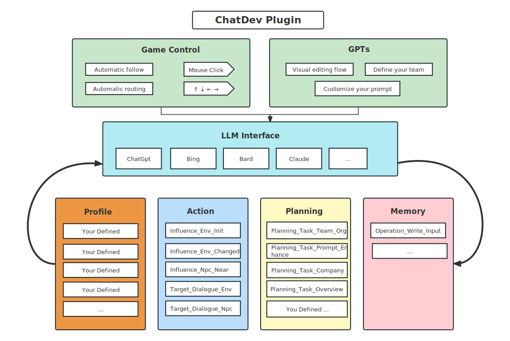
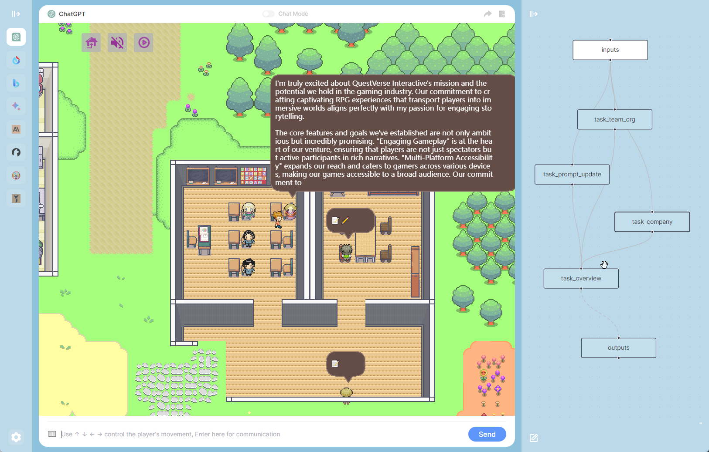

    

<h1 align="center">ChatDev：可视化您的AI代理</h1>

[![author][author-image]][author-url]
[![license][license-image]][license-url]
[![release][release-image]][release-url]
[![last commit][last-commit-image]][last-commit-url]

[英语](README.md) &nbsp;&nbsp;|&nbsp;&nbsp; [印尼语](README_IN.md) &nbsp;&nbsp;|&nbsp;&nbsp; [简体中文](README_ZH-CN.md) &nbsp;&nbsp;|&nbsp;&nbsp; 繁體中文 &nbsp;&nbsp;|&nbsp;&nbsp; [日本語](README_JA.md)
##

### ⚡️ 安装

##

[屏幕截图](#-屏幕截图) &nbsp;&nbsp;|&nbsp;&nbsp; [功能](#-功能) &nbsp;&nbsp;|&nbsp;&nbsp; [机器人](#-机器人) &nbsp;&nbsp;|&nbsp;&nbsp; [安装](#-安装) &nbsp;&nbsp;|&nbsp;&nbsp; [更改记录](#-更改记录)

[author-image]: https://img.shields.io/badge/author-10cl-blue.svg
[author-url]: https://github.com/10cl
[license-image]: https://img.shields.io/github/license/10cl/chatdev?color=blue
[license-url]: https://github.com/10cl/chatdev/blob/main/LICENSE
[release-image]: https://img.shields.io/github/v/release/10cl/chatdev?color=blue
[release-url]: https://github.com/10cl/chatdev/releases/latest
[last-commit-image]: https://img.shields.io/github/last-commit/10cl/chatdev?label=last%20commit
[last-commit-url]: https://github.com/10cl/chatdev/commits

**ChatDev** 是一个强大的 **Chrome扩展程序**，它集成了多个大型语言模型界面，提供多样化的对话体验。通过对Prompt-Flow任务序列的视觉定制，您不仅可以在游戏中探索不同大型模型的性能，还可以创建自己的任务执行流程。与虚拟NPC互动，丰富您的体验，并通过选择您喜欢的大型模型在AI城镇中创造独特的回忆。

## 📷 屏幕截图

## ✨ 功能
* 在一个应用程序中使用不同的聊天机器人，目前支持ChatGPT、新的Bing Chat、Google Bard、Claude和超过10个开源模型。
* 通过Webapis的形式在浏览器中调用大型模型接口，无需编码能力。
* 以游戏的形式与NPC互动，讨论真实需求。
* 自定义NPC角色定义。
* 自定义NPC行为和计划提示。
* 自定义提示流程。
* 一旦启用提示流程，只需用一句话表达您的需求，NPC将被自动选择以组成团队、执行任务，并以交互式游戏方式呈现。

## 🤖 机器人
支持的ChatGPT & iFlytek Spark & Bing & Bard & Claude & ChatGLM & Alpaca & Vicuna & Koala & Dolly & LLaMA & StableLM & OpenAssistant & ChatRWKV...

## 🔨 安装

### 1. 从Chrome Web Store安装

在[Chrome Web Store](https://chrome.google.com/webstore/category/extensions)中搜索[ChatDev](https://chrome.google.com/webstore/detail/chatdev/dopllopmmfnghbahgbdejnkebfcmomej)，然后单击"安装"。

### 2. 手动安装

1. 从发布页面下载 `chatdev1.1.1.zip`。
2. 解压文件。
3. 在Chrome/Edge中，打开扩展页面（`chrome://extensions`或`edge://extensions`）。
4. 启用开发者模式。
5. 将已解压的文件夹拖放到页面上以导入它（导入后不要删除文件夹）。

### 3. 从源代码构建

* 克隆源代码。
* 运行 `yarn install` 安装依赖项。
* 运行 `yarn build` 构建插件。
* 按照"手动安装"中的步骤将`dist`文件夹加载到您的浏览器中。

## 📜 更改记录
* v1.1.1

    * 提示流程双击可编辑节点。
    * 导入或导出所有配置。
    * 提示库共享。
* v1.1.0

    * 支持多个大型语言模型。
    * 用户角色的自定义。
    * 支持自定义提示（操作、计划等）。
    * 自定义提示流程的新视觉编辑。
    * 支持在聊天视图和游戏视图之间切换。
    * 预定义的提示流程，允许一句话请求自动选择NPC，组建团队，执行任务，并以交互式游戏方式呈现。
    * 设置按钮以自定义API和选择首选模型。
    * 修复了iFlytek Spark模型的API问题。
* v1.0.1

    * 增加了对iFlytek Spark认知大型语言模型的支持。
* v1.0.0

    * 基于ChatGPT的AI城镇插件的初始版本。

## 🤝 致谢

我们由衷感谢以下项目提供的灵感和参考资料：[generative_agents](https://github.com/joonspk-research/generative_agents)、[chathub](https://github.com/chathub-dev/chathub)。

无论您想探索不同大型语言模型的奇迹还是创建自己的虚拟城市生活，ChatDev都将成为您可靠的助手。现在安装它，开始探索吧！
